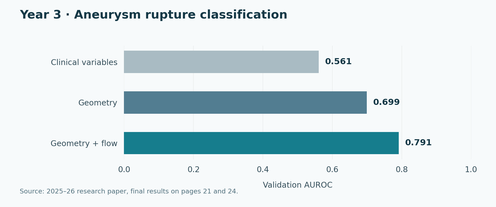

# Multimodal Aneurysm Rupture Risk Modeling

Can vascular geometry, hemodynamic measurements, and clinical variables help distinguish ruptured from unruptured cerebral aneurysms?

I developed this research code to compare those inputs through point-cloud models, multimodal fusion, graph neural networks, voxel CNNs, and physics-informed neural networks. The study connects aneurysm detection, flow estimation, and classification of rupture status.

**Research Year 3 · Python · PyTorch · Computational hemodynamics**  
[Research paper, 2025–26 (PDF)](papers/science-research-2025-26.pdf)

## Findings

| Rupture classification model | Validation AUROC |
| --- | ---: |
| Clinical variables | 0.561 |
| Geometry | 0.699 |
| Geometry and flow ensemble | 0.791 |

The final results on pages 21 and 24 of the 2025–26 paper report the strongest discrimination when geometry and flow are combined. The paper describes five-fold validation with an 80/20 training/validation division; it does not specify patient grouping. The table follows those final results, which differ from the earlier values in the abstract.

*Validation AUROC reported in the Year 3 paper.*

## My contributions

- Developed models for learning from vascular geometry and hemodynamic point data.
- Compared clinical, geometry, flow, graph, and voxel representations and combinations of modalities.
- Implemented physics-informed flow-modeling experiments and analysis of derived hemodynamic features.
- Established consistent case selection and evaluation across the modeling experiments.

The paper places this work within a broader detection, flow modeling, and visualization pipeline, with mentorship from Dr. Xianqi Li at Florida Institute of Technology. This repository contains the rupture-classification study. The [web](https://github.com/evipuil/HemoViz3D-Web-App-ResearchY1) and [VR](https://github.com/evipuil/HemoViz3D-VR-App-ResearchY2) projects document the earlier visualization work.

## Preprint

**Preprint:** Eshan Vipuil and Xianqi Li. [Integrating Physics-Informed Neural Networks and 3D Vascular Geometry Learning for Cerebral Aneurysm Detection and Multimodal Rupture-Risk Prediction](https://arxiv.org/abs/2607.10530). arXiv, July 2026. [Read the PDF](https://arxiv.org/pdf/2607.10530).

The preprint presents a later version of the detection and multimodal modeling study. The results above remain those of the 2025–26 school research paper.

## Research papers

- [2023–24: Web visualization (PDF)](papers/science-research-2023-24.pdf)
- [2024–25: Virtual reality visualization (PDF)](papers/science-research-2024-25.pdf)
- [2025–26: Aneurysm detection and rupture modeling (PDF)](papers/science-research-2025-26.pdf)

## Methods

[Methods and analysis](METHODS.md) describes the model families, data requirements, and available programs. The [Year 4 study](https://github.com/evipuil/Cerebral-Aneurysm-Modeling-ResearchY4) examines patient-grouped validation, generalization, and FEM-informed flow models.
